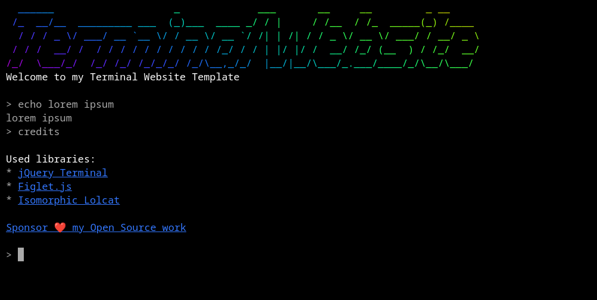

# Terminal Website Template

This is a [simple template for a Terminal based website](https://github.com/jcubic/terminal-website-template).
It uses:

* [jQuery Terminal](https://terminal.jcubic.pl/)
* [Figlet.js](https://github.com/patorjk/figlet.js/)
* [Isomorphic Lolcat](https://github.com/jcubic/isomorphic-lolcat)

## Usage
You can download index.html, main.js, and favicon.ico files.
You can also click use this template button to create new repository.

If you want to learn how to create a terminal like this yourself, you can read those articles:
* [How to create interactive terminal like website with JavaScript?](https://itnext.io/how-to-create-interactive-terminal-like-website-888bb0972288) (beginner friendly)
* [How to Create an Interactive Terminal Portfolio Website](https://www.freecodecamp.org/news/how-to-create-an-interactive-terminal-portfolio-website/)

## License
Copyright (c) 2024 [Jakub T. Jankiewicz](https://jakub.jankiewicz.org) 
Released under MIT license
